# **Applikationsbeschreibung OneWire**

Die Applikation OneWire ist im File WireGateway-v3.x.knxprod enthalten und erlaubt die Parametrisierung des WireGateways mittels der ETS.

Sie ist in die Bereiche

* Allgemeine Parameter
* 1-Wire
* Logikkanäle

gegliedert.

Der letzte Punkt ist in der Applikationsbeschreibung [LogicModule](https://github.com/OpenKNX/OAM-LogicModule/blob/main/doc/Applikationsbeschreibung-Logik.md) beschrieben.

## **Änderungshistorie**

18.02.2023: Firmware 1.0, Applikation 1.0

* Anpassungen, damit das OneWireModule auch mit dem RP2040 benutzt werden kann
* NEU: Das KO 'IDs unbekannter Geräte' wird nicht mehr ausgeschaltet, wenn die Geräteerkennung bei 1-Wire abgeschaltet wird.
* Aktualisierung des Logikmoduls auf die neuste Version 1.4.2.

09.01.2023: Firmware 0.8 (Beta)

* Initiales OpenKNX Release
* Basiert auf dem [Vorgänger-WireGateway](https://github.com/mumpf/knx-wire) version 3.8 (im folgenden stehen die Neuerungen gegenüber 3.8)
* Erzeugung von Firmware und knxprod wurde stark vereinfacht
* (intern) verbesserte Kommunikation mit dem KNX-Bus
* ETS-Applikation wird auch mit der ETS 6 getestet
* Eingänge können jetzt auch beliebige Kommunikationsobjekte der gesamten Applikation (nicht nur des Logikmoduls) sein, keine Verbindung über GA nötig
* Die ETS-Applikation wurde optisch überarbeitet und übersichtlicher gestaltet
* ETS-Kanäle werden neu unterstützt
* Es wird technisch überprüft, ob die ETS-Applikation mit der installierten Firmware übereinstimmt
* **Wichtig:** Diese Version ist eine komplett neue Applikation und somit nicht kompatibel zu der früheren Version 3.8. Die ETS-Applikation muss komplett neu parametrisiert werden.

## **Einleitung**

Diese Applikation erlaubt es, 1-Wire-Geräte, die über den 1-Wire-Bus mit dem WireGateway verbunden sind, passend zu parametrisieren und deren Werte auf den KNX-Bus zu senden. Falls die 1-Wire-Geräte Ausgaben erlauben, ist es auch möglich, KNX-Telegramminhalte an den Ausgängen der 1-Wire-Geräte verfügbar zu machen.

Auch wenn diese Anleitung für das WireGateway ist, wird die gleiche Applikation auch für das Sensormodul verwendet und kann hierfür herangezogen werden. An den wenigen Stellen, an den sich die Einstellungen im Sensormodul unterscheiden, wird speziell darauf hingewiesen.

Der 1-Wire-Bus ist so entworfen, dass alle angeschlossenen Geräte immer wieder abgefragt werden müssen, ob sie neue Werte haben (polling). Da diese Abfragen einige Zeit benötigen, ist der 1-Wire-Bus nicht dazu geeignet, kurzfristige Ereignisse (Zählimpulse, kurze Tastendrücke) zu erfassen oder unmittelbar auf so ein Ereignis zu reagieren. Aus diesem Grunde bietet die KNX-Applikation auch nur Funktionalitäten an, die sich für Sensorabfragen bzw. Fensterkontakte eignen, also alles keine zeitkritischen Ereignisse.

### **1-Wire-Geräte**

Beim 1-Wire-Bus wird jede digital ansprechbare Einheit über eine weltweit eindeutige ID angesprochen. Es ist aber nicht so, dass jedes physikalische Gerät nur eine ID hat. So liefert 1-Wire-Luftfeuchtesensor - verkauft als ein Gerät mit einem 1-Wire-Anschluss - zwei ID: Eine zum ansprechen des Temperatursensors und eine zum ansprechen des Luftfeuchtemessers.

In dieser Applikation wird alles, was eine 1-Wire-ID liefert, als ein (virtuelles) Gerät betrachtet. Der oben erwähnte Sensor würde somit 2 Geräte repräsentieren: Temperatur und Luftfeuchte. Ein 1-Wire-Gerät hat auf der KNX-Seite genau ein KO zugewiesen.

Leider ist die Betrachtung komplizierter. Es gibt 1-Wire-Geräte, die liefern nur eine 1-Wire-ID (z.B. ein 8-Kanal-IO), aber mehrere Funktionen, die ein KO erfordern. Ein 8 Bit-IO kann über ein 1-Byte-KO mit dem KNX-Bus kommunizieren, aber auch über 8 1-Bit-KO. Es obliegt hier dem Nutzer, die Art der Nutzung festzulegen und das entsprechend zu parametrieren. Aus Sicht von KNX wären dann aber 8 1-Bit-KO dann 8 Geräte (z.B. 8 Fensterkontakte).

Zusammenfassung: Die Applikation bietet pro 1-Wire-Busmaster maximal 30 Geräte an. Da bis zu 3 Busmaster (beim Sensormodul nur 1 Busmaster) genutzt werden können, werden somit maximal 90 Geräte angeboten. Diese 30 Geräte/Busmaster entsprechen aber nicht 30 physikalischen 1-Wire-Entitäten. Sie entsprechen eher 30 Kommunikationskanälen, es stehen 30 KO zur Verfügung, über die man mit dem 1-Wire-Bus kommunizieren kann. Wie die 30 KO auf reale 1-Wire-Geräte verteilt werden, wird in der Applikation parametriert.

Es wurde der Begriff "Gerät" und nicht "Kanal" gewählt, um Verwechslungen mit Logikkanälen zu vermeiden.

> **Achtung**: Da die Qualität der Signale auf dem 1-Wire-Bus sehr stark von der Bustopologie, der Qualität der elektrischen Leitungen, der Güte der  Verbindungen bei Leitungsverzweigungen und von der Anzahl der mit dem Bus verbundenen Geräte abhängt, kann nicht garantiert werden, dass 30 Geräte genutzt werden können, selbst wenn sie den oben genannten Bedingungen genügen (z.B. 30 Temperatursensoren, die alle nur eine ID haben). Die maximal nutzbare Anzahl von 1-Wire-Geraten am eigenen 1-Wire-Bus muss experimentell festgestellt werden.

### **ID-Suche**

Die gesamte 1-Wire-Kommunikation basiert auf einer weltweit eindeutigen ID für jedes 1-Wire-Gerät. Diese ID muss man kennen und in der Applikation eingeben. Falls eine solche ID nicht bekannt ist, kann diese ID auch mit diesem Modul ermittelt werden, da es auch eine ID-Suche unterstützt und alle ID, die es auf dem 1-Wire-Bus ermittelt hat und die noch nicht bekannt sind, über ein entsprechendes Kommunikationsobjekt ausgeben kann.

Das Verfahren ist relativ einfach: Man schließt ein neues 1-Wire-Gerät an den 1-Wire-Anschluss des Moduls an, wobei der parasitäre Anschluss nicht unterstützt wird. Nach 1-2 Sekunden erscheinen neu gefundene IDs am KO20. Dazu muss die Suche nach neuen Geräten parametriert sein.

### **Unterstützte Geräte**

1-Wire-Geräte sind in sogenannte Familien gegliedert, die an den ersten 2 Stellen der ID erkannt werden können. Diese Applikation unterstützt folgende 1-Wire-Familien:

    01 - iButton (DS1990)
    10 - Temperatur (DS18S20)
    26 - Analogsensor (DS2438)
    28 - Temperatur (DS18B20)
    29 - 8-Kanal-IO (DS2408)
    3A - 2-Kanal-IO (DS2413)

Es werden keine Geräte mit parasitärem Anschluss unterstützt, somit müssen immer alle 3 Anschlüsse 0, Date und VDD angeschlossen werden. Die Ausnahme hier ist der iButton, der prinzipiell nur 2 Anschlüsse aufweist.

## **Allgemeine Parameter**

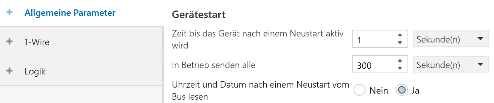
Hier werden Einstellungen getroffen, die die generelle Arbeitsweise des WireGateway bestimmen.

### **Zeit bis das Gerät nach einem Neustart aktiv wird**

Nach einem Neustart des Geräts, sei es durch Busspannungsausfall, Reset über den Bus oder auch durch ein Drücken der Reset-Taste, kann man hier festlegen, wie viele Sekunden vergehen sollen, bis das Gerät seine Funktion aufnimmt.

Da das Gerät prinzipiell (sofern parametriert) auch Lesetelegramme auf den Bus senden kann, kann mit dieser Einstellung verhindert werden, dass bei einem Busneustart von vielen Geräten viele Lesetelegramme auf einmal gesendet werden und so der Bus überlastet wird.

### **In Betrieb senden alle**

Das Gerät kann einen Status "Ich bin noch in Betrieb" über das KO 1 senden. Hier wird das Sendeintervall in Sekunden eingestellt.

### **Uhrzeit und Datum nach einem Neustart vom Bus lesen**

Dieses Gerät kann Uhrzeit und Datum vom Bus empfangen. Nach einem Neustart können Uhrzeit und Datum auch aktiv über Lesetelegramme abgefragt werden. Mit diesem Parameter wird bestimmt, ob Uhrzeit und Datum nach einem Neustart aktiv gelesen werden.

Wenn dieser Parameter gesetzt ist, wird die Uhrzeit und das Datum alle 20-30 Sekunden über ein Lesetelegramm vom Bus gelesen, bis eine entsprechende Antwort kommt. Falls keine Uhr im KNX-System vorhanden ist oder die Uhr nicht auf Leseanfragen antworten kann, sollte dieser Parameter auf "Nein" gesetzt werden.

Die im Modul enthaltenen Zeitschaltuhren beginnen erst zu funktionieren, wenn eine gültige Uhrzeit und ein gültiges Datum empfangen wurde. Wenn dieser Parameter auf "Nein" gesetzt wird, kann es sehr lange dauern, bis Zeitschaltuhren nach einem Neustart ihre Funktion aufnehmen.

## Experteneinstellungen

Details zu Experteneinstellungen sind in der Applikationsbeschreibung [LogicModule](https://github.com/OpenKNX/OAM-LogicModule/blob/main/doc/Applikationsbeschreibung-Logik.md) beschrieben.

## **1-Wire**

### **Busmaster-Einstellungen**

Jeder 1-Wire-Busmaster erfordert bestimmte Einstellungen, die in diesem Dialog eingetragen werden.

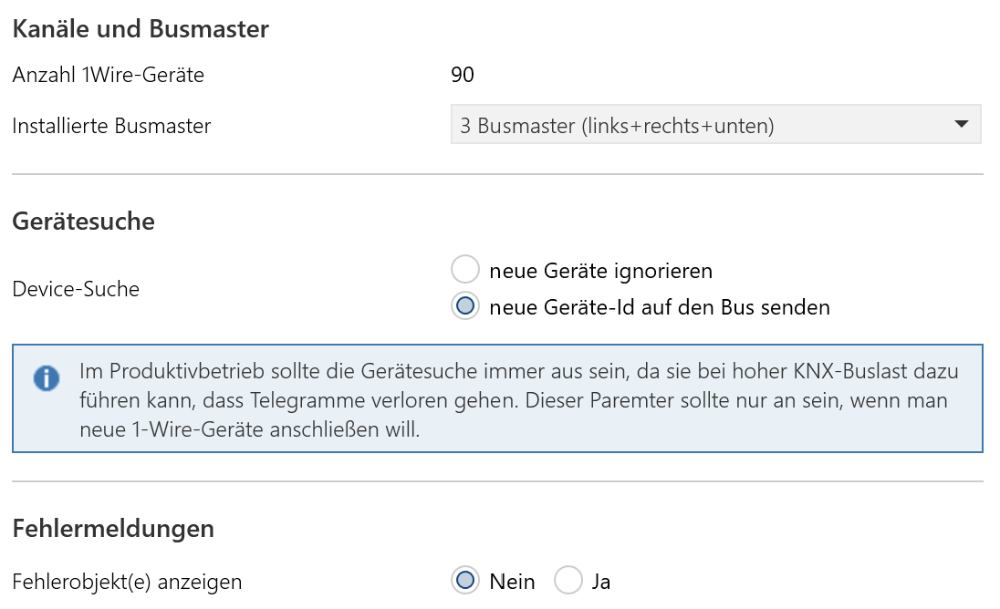

### Kanäle und Busmaster

#### **Anzahl 1Wire-Geräte**

Die Zahl gibt an, wie viele 1-Wire-Geräte insgesamt von der Applikation verwaltet werden können. Es gilt immer die Regel, dass es maximal 30 pro Busmaster sind.

#### **Installierte Busmaster**

Das WireGateway kann hardwareseitig mit bis zu 3 Busmaster bestückt werden. Jeder Busmaster kann bis zu 30 1-Wire-Kanäle verwalten.

Hier gibt man an, wie viele Busmaster bestückt sind.

Dieses Feld ist nicht in der Applikation zum Sensormodul sichtbar. Beim Sensormodul ist maximal ein 1-Wire-Busmaster bestückt und somit sind maximal 30 Geräte möglich.

### Gerätesuche 

#### **Device-Suche**

Um die ID von neuen 1-Wire-Geräten herauszufinden, kann man diese mit dem 1-Wire-Anschluss verbinden. Daraufhin wird über das KO20 "IDs unbekannter Geräte" die ID dieses Gerätes ausgegeben. Dazu muss die Einstellung "neue Geräte-Id auf den Bus senden" ausgewählt sein.

Die ausgegebene ID ist vom Typ DPT16 und kann im Gruppenmonitor ausgelesen werden. Das Telegramm ist einfach zu erkennen, es hat rechts in der Spalte Info folgendes Aussehen:
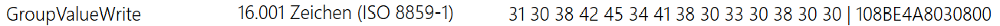
Dabei ist der Wert des Telegramms wichtig, im angezeigten Beispiel sind es die Zeichen ganz am Ende der Zeile hinter dem senkrechten Strich "|":

    108BE4A8030800

Diese Id ist später für die ID-Eingabe wichtig. Dabei bilden die ersten beiden Stellen (im Beispiel die 10) die Gerätefamilie ab. Die Folgenden Stellen müssen dann über passende Auswahlfelder eingegeben werden. Die obige ID sieht dann in der Applikation so aus:
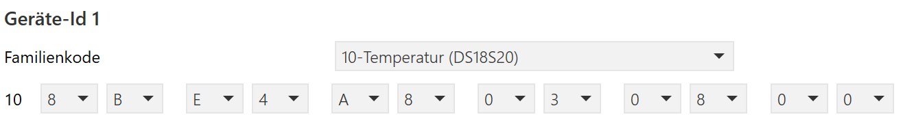

Sobald man alle neuen Geräte an den 1-Wire-Bus angeschlossen hat, sollte man die Einstellung "neue Geräte ignorieren" auswählen und nur so in den produktiven Betrieb gehen.

Die Suche von neuen Geräten auf dem 1-Wire-Bus kostet (relativ zu einer Geräteabfrage) sehr viel Zeit und ist zudem noch Timing-kritisch. Bei eingeschalteter Geräte-Suche ist es sehr wahrscheinlich, dass Signalisierungen von iButton oder Inputs von IO-Bausteinen stark verspätet (>2 Sekunden) oder gar nicht ankommen. Das entsprechende gilt für Outputs.

Daher gilt ganz klar die Empfehlung, dass die Suche nur für den Anschluss neuer Geräte aktiviert werden sollte.

#### **Fehlerobjekt(e) anzeigen**

Ist diese Option mit 'Ja' ausgewählt, wird pro installiertem Busmaster ein 32-Bit-KO eingeblendet, bei dem für jedes 1-Wire-Gerät, das einen Fehler meldet oder nicht abgefragt werden kann, das entsprechende Bit auf 1 gesetzt wird.

Da es derzeit noch keine befriedigende (sprich: für den User erklärbare) Zuordnung zwischen einem bestimmten Bit und dem zugehörigen 1-Wire-Gerät gibt, kann das Fehlerobjekt derzeit nur so genutzt werden, dass eine 0 für "alles OK" steht, und ein "ungleich 0" für einen allgemeinen Fehler (irgendein Sensor geht nicht).

In zukünftigen Versionen soll es eine stabile Zuordnung zwischen Bit und Sensor geben.

### **iButton Gruppierung**

Falls mit diesem Modul keine iButton eingesetzt werden, kann dieses Kapitel komplett ignoriert werden.

iButton können als virtuelle Marker oder Schlüssel betrachtet werden, die Existenz eines iButton am Bus kann eine Aktion auslösen, die Nichtexistenz eine andere.

Man kann aber auch Aktionen an Gruppen von iButton hängen, so etwas wie "nur wenn der rote und grüne iButton da ist, soll die Musik starten".

Diese Applikation erlaubt die Definition von bis zu 8 iButton-Gruppen, in denen beliebig viele iButton enthalten sein können.

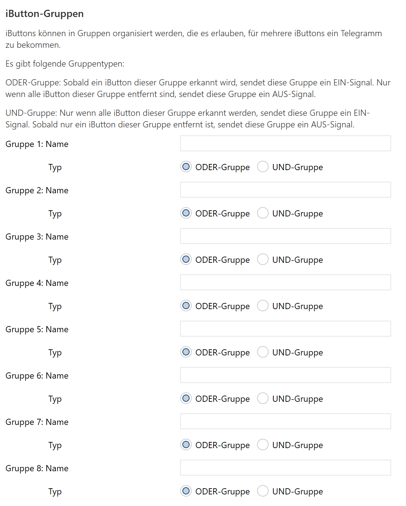

Jede Gruppe kann einen Namen erhalten, der frei wählbar ist. Dieser Name wird auch als Name für das entsprechende KO der Gruppe verwendet.

Ferner kann jede Gruppe auch einen Typ haben:

* ODER-Gruppe: Sobald ein iButton dieser Gruppe erkannt wird, sendet die Gruppe ein AN-Signal auf ihrem zugehörigen KO. Nur wenn alle iButton dieser Gruppe nicht erkannt werden, sendet diese Gruppe ein AUS.
* UND-Gruppe: Erst wenn alle iButton dieser Gruppe erkannt werden, sendet die Gruppe ein AN-Signal. Sobald auch nur ein iButton der Gruppe fehlt, wird ein AUS-Signal gesendet.

Welche iButton an welcher Gruppe beteiligt sind, wird dann bei den jeweiligen iButton-Geräten festgelegt.

Beispiel: iButton repräsentieren die Anwesenheit von Personen zu Hause (z.B. über ein elektronisches Schlüsselbrett). Es gibt folgende iButton:

* rot: Mutter
* blau: Vater
* gelb: Marie (Kind 1)
* grün: Klaus (Kind 2)

Folgende Gruppen könnten dann sinnvoll sein:

* Alle zu Hause: UND-Gruppe, an der alle iButton teilnehmen
* Irgendjemand zu Hause: ODER-Gruppe, an der alle iButton teilnehmen
* Beide Eltern zu Hause: UND-Gruppe, nur mit rot und blau
* Alle Kinder zu Hause: UND-Gruppe, nur mit gelb und grün
* Irgendein Kind zu Hause: ODER-Gruppe, nur gelb und grün
* Irgendein Elternteil zu Hause: ODER-Gruppe, nur mit rot und blau

Falls 8 Gruppen nicht reichen, kann das integrierte Logikmodul für weitere Kombinationen genutzt werden.

Falls die Gruppen negiert werden sollen (keiner zu Hause = NOT Irgendjemand zu Hause), kann das integrierte Logikmodul hierfür verwendet werden.

### **Gerät *n***

Jedes 1-Wire-Gerät wird auf die gleiche Weise definiert, deswegen werden hier exemplarisch nur die Parameter für ein Gerät beschrieben.

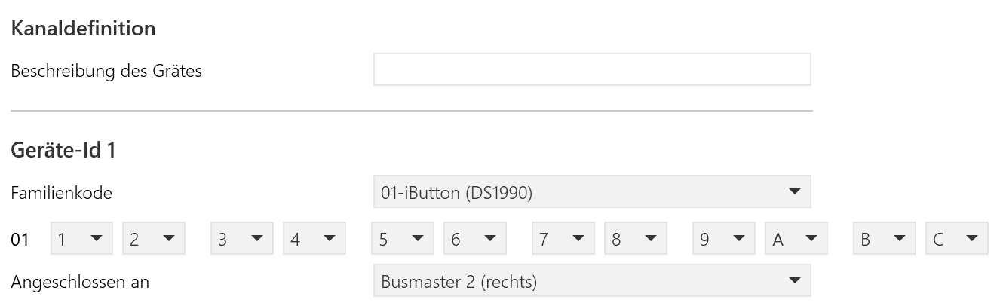

### Kanaldefinition

#### **Beschreibung des Gerätes**

Hier kann ein frei wählbarer Name für das Gerät gewählt werden. Der Name wird sowohl links in der Tab-Übersicht verwendet wie auch als Name des zugehörigen KO. Wie schon in der Einleitung beschrieben, repräsentieren Geräte eher die KNX-Sicht: Ein Gerät repräsentiert das KO, über das es kommuniziert.

### Geräte-Id *n*

#### **Familienkode**

In dieser Auswahlliste wird der Familiencode des 1-Wire-Gerätes ausgewählt. Der Code entspricht den ersten beiden Stellen der Geräte-ID.

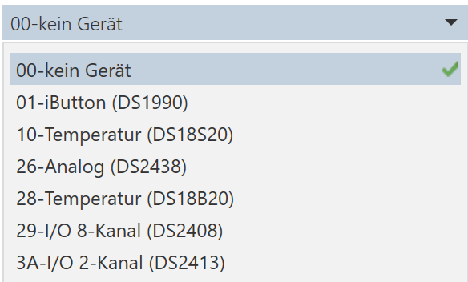

Folgende Familiencodes sind verfügbar:

    01 - iButton (DS1990)
    10 - Temperatur (DS18S20)
    26 - Analogsensor (DS2438)
    28 - Temperatur (DS18B20)
    29 - 8-Kanal-IO (DS2408)
    3A - 2-Kanal-IO (DS2413)

Der Unterschied zwischen den Familien 10 und 28 liegt darin, dass der DS18S20 nur in der Genauigkeit von 0.5 °C messen kann, der DS18B20 in einer Genauigkeit von 0.125 °C messen kann.

Sobald ein Familienkode ausgewählt wurde, kann die ID des 1-Wire-Gerätes eingegeben werden. Die ersten beiden Stellen der ID sind der Familiencode, die restlichen 12 Stellen können als Hexadezimalziffern eingegeben werden. Dazu erschent pro Stelle eine Auswahlliste mit den Ziffern 0-9 und A-F.

**Tipp zur Eingabe**: Sobald man die erste Stelle über die Auswahlliste eingegeben hat, kann man mit der Taste "Tab" zur nächsten Stelle springen und die passende Ziffer (0-9, A-F) über die Tastatur auswählen. Dadurch ist die Eingabe wesentlich schneller als mit der Maus über Auswahllisten.

#### **Angeschlossen an**

In dieser Auswahlliste muss angegeben werden, an welchem Busmaster dieses Gerät angeschlossen worden ist. Ist nur ein Busmaster verfügbar, steht dort der nicht änderbare Wert "Busmaster 1".

## **Familienspezifische Geräteparameter**

Verschiedene Gerätefamilien liefern unterschiedliche Werte, die auf passende KNX-KO mit passendem DPT übersetzt werden müssen. Ferner bietet die Applikation KNX-übliche Parametrierung für bestimmte Familien an, damit sich 1-Wire-Geräte wie "normale" KNX-Geräte verhalten.

In den folgenden Kapiteln werden die Geräteparameter pro Familie beschrieben.

### **Familie 01 - iButton**

iButtons (das 1-Wire-Gerät DS1990) erlauben eine einfache Möglichkeit, eine Signalerkennung zu realisieren. Wenn ein iButton am 1-Wire-Bus angeschlossen ist, kann über seine eindeutige ID erkannt werden, dass es exakt dieser iButton ist. Somit ist die Existenz eines iButton ein verwertbares Signal. iButtons sind so gebaut, dass sie einfach (z.B. über einen magnetischen Halter) mit dem Bus verbunden werden können.

Wird die Familie 01 ausgewählt, erscheint ein passendes 1-Bit-KO mit dem für dieses Gerät vergebenen Namen. Wird der iButton mit seiner ID am 1-Wire-Bus erkannt, sendet das zugehörige KO eine 1. Sobald der iButton nicht mehr am Bus erkannt wird, sendet das KO eine 0.

#### **Nach einem Neustart Zustand auf den Bus senden (auch für alle beteiligten Gruppen)?**

Wird hier ein Ja angegeben, wird nach einem Neustart der WireGateways für diesen iButton eine 1 gesendet, sofern er am Bus erkannt wird.

 Die Architektur des 1-Wire-Busses macht es erforderlich, dass kontinuierlich der Bus nach dem Vorhandensein eines iButton abgefragt wird. Das Modul fragt somit andauernd (ca. 4 mal pro Sekunde) ab, oder der iButton noch da ist. Kurzfristige Kurzschlüsse (z.B. durch das hinzufügen eines weiteres iButton), Scanfehler oder Störungen auf dem Bus können dazu führen, dass ein iButton bei einer Abfrage da ist, bei der darauffolgenden nicht und dann wieder da ist, obwohl der iButton nicht vom Bus getrennt wurde. In solchen Fällen will man natürlich nicht, dass auf dem KNX-Bus eine 1, gefolgt von einer 0, gefolgt von einer 1 gesendet wird. Um das zu umgehen, müssen 3 aufeinanderfolgende Abfragen des iButtons eine Nichtexistenz ergeben, bevor eine 0 auf den KNX-Bus gesendet wird. Dies hat zur Folge, dass es nach dem Anschluss eines iButton an den 1-Wire-Bus ca. 0.2 bis 0.3 Sekunden dauert, bis eine 1 auf den KNX-Bus gesendet wird. Beim Entfernen vom iButton dauert es aber ca. 0.6 bis 0.8 Sekunden, bis eine 0 gesendet wird.

Wie im Kapitel "iButton Gruppierung" beschrieben, können iButton auch an Gruppen teilnehmen.

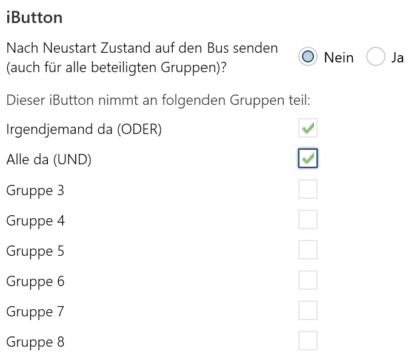

In der Abbildung nimmt der iButton an der Gruppe 1 und Gruppe 2 teil. Die Gruppen erscheinen mit dem bei der Gruppendefinition vergebenen Namen. Falls kein Name vergeben wurde, wird der Standardname "Gruppe *n*" angezeigt.

### **Familie 10 und 28 - Temperatur**

Temperaturen können über 1-Wire sehr günstig gemessen werden. Die verfügbaren Sensoren DS18S20 und DS18B20 unterscheiden sich nur in der Genauigkeit:

* Der DS18S20 misst mit einer Genauigkeit von 0.5 °C
* Der DS18B20 misst mit einer Genauigkeit von 0.125 °C

Alle weiteren Parameter für die beiden Familien sind identisch.

Wird die Familie 10 oder 28 ausgewählt, erscheint ein passendes KO DPT9 mit dem für dieses Gerät vergebenen Namen.

Ferner erscheinen ein paar weitere Eingabefelder, mit denen man das Verhalten als Temperatursensor parametrisieren kann.

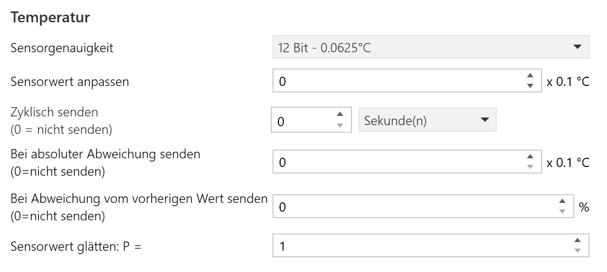

#### **Sensorgenauigkeit**

Erscheint nur, wenn Familie 28 ausgewählt wurde. Dann kann man eine der möglichen Sensorgenauigkeiten auswählen.

#### **Sensorwert anpassen**

Mit dieser Einstellung kann der Sensor kalibriert werden. Der eingegebene Wert wird zum gemessenen Wert addiert. Man kann den Sensorwert um -10 absenken und bis zu +10 erhöhen. Die Werte werden in Zehntel angegeben, so dass die Eingabe von -100 bis +100 in ganzen Zahlen zu erfolgen hat.

#### **Zyklisch senden (0 = nicht senden)**

Der Sensorwert kann in bestimmten Zeitintervallen auf den Bus gesendet werden. Hier wird das Zeitintervall angegeben.

Wird eine 0 angegeben, wird der Sensorwert nicht zyklisch gesendet.

#### **Bei absoluter Abweichung senden (0 = nicht senden)**

Der Sensorwert kann auch gesendet werden, wenn der aktuell gemessene Wert um einen festgelegten Wert von dem zuletzt gesendeten Wert nach oben oder unten abweicht.

Hier wird die Abweichung in 0.1-Schritten angegeben. Soll also bei einer Abweichung von 0.5 gesendet werden, muss hier eine 5 angegeben werden.

Wird eine 0 angegeben, wird bei einer absoluten Abweichung nicht gesendet.

#### **Bei Abweichung vom vorherigen Wert senden (0 = nicht senden)**

Der Sensorwert kann auch gesendet werden, wenn der aktuell gemessene Wert um einen bestimmten Prozentsatz von dem zuletzt gesendeten Wert nach oben oder unten abweicht.

Hier wird die Abweichung in % angegeben. Bei einem zuletzt gesendeten Wert von 20  und einen angegebenen Abweichung von 5% wird erneut gesendet, wenn der Sensorwert 21 überschreitet oder 19°unterschreitet (5% von 20 ist 1).

Wird eine 0 angegeben, wird bei einer relativen Abweichung nicht gesendet.

#### **Sensorwert glätten: P =**

Falls der Sensor zu empfindlich ist und man starke Schwankungen im Temperaturmesswert hat, kann man eine Glättungsfunktion nutzen, um starke Messwertschwankungen abzumildern. Die hier verwendete Funktion ist vergleichbar mit einer Durchschnittsberechnung über eine gewisse Anzahl vergangener Messwerte, funktioniert aber im Detail anders.

Es wird folgende Glättungsformel verwendet:

Xneu = Xalt + (M - Xalt) / P

wobei

* Xneu der geglättete Wert,
* Xalt der zuvor ermittelte geglättete Wert,
* M der aktuelle Messwert und
* P der einzugebende Glättungsfaktor

ist. Intern wird alle 5 Sekunden ein neuer Messwert ermittelt, der dann mittels dieser Formel geglättet wird. Ein P von 1 führt zu keiner Glättung, jeder Messwert wird übernommen. Ein Wert von 12 führt zu einer Glättung über die Werte einer Minute (5s * 12 = 60s), ein Wert von 120 zu einer Glättung von 10 Minuten und 720 zu einer Glättung von einer Stunde.

Die Glättung wird durchgeführt, bevor eine Sendebedingung für die absolute oder relative Abweichung ermittelt wird.

Der neu ermittelte Wert wird alle 5 Sekunden auf das entsprechende KO geschrieben, ganz egal, ob das KO diesen Wert sendet oder nicht. Somit können vom Modul alle 5 Sekunden aktuelle Sensorwerte gelesen werden, unabhängig von parametrisierten Sendebedingungen.

### **Familie 26 - Analog**

Der Smart Battery Monitor DS2438 ist eigentlich für Batteriemanagement gedacht. Er wird aber in vielen 1-Wire-Geräten dazu genutzt, Sensoren mit einem Analogen Ausgangssignal an den 1-Wire-Bus anzuschließen.

Wird die Familie 26 ausgewählt, erscheint ein passendes KO DPT9 mit dem für dieses Gerät vergebenen Namen.

#### **Modellfunktion**

Für ein Gateway zum KNX ist es schwer, ein solch generisches Gerät zur Verfügung zu stellen, da man üblicherweise komplizierte Formeln braucht, um den eingehenden Analogwert in einen entsprechenden digitalen Wert umzuwandeln. Dies ist um so komplizierter, als dass der gemessene Analogwert immer von der Spannung abhängt, die gerade am DS2438 anliegt und von der Wärme des Chips selbst.

Man kann den DS2438 auf verschiedene Arten verwenden. Über die Auswahlliste Modellfunktion können diese Verwendungsarten festgelegt werden.

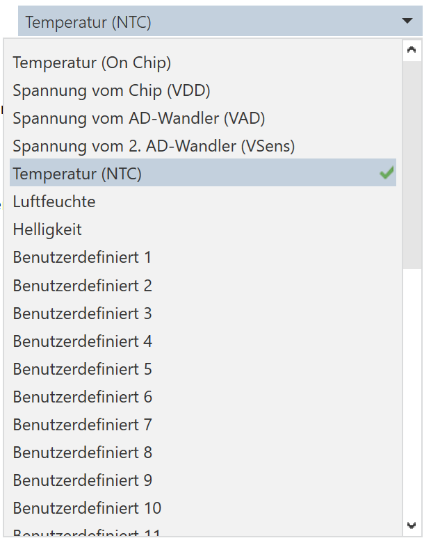

Zum einen kann man alle gemessenen Werte des Sensors auf den KNX-Bus senden und in einer KNX-Logik den passenden finalen Sensorwert berechnen. Dazu legt man für einen DS2438 bis zu 4 Geräte an (alle mit der selben ID), jedes Gerät bekommt aber eine andere Modellfunktion und sendet somit verschiedene Werte auf den KNX-Bus:

* Temperatur (On Chip) - sendet die gemessene Temperatur des Bausteins zum Zeitpunkt der Messung
* Spannung vom Chip (VDD) - sendet die Spannung, die am Baustein anliegt, zum Zeitpunkt der Messung
* Spannung vom AD-Wandler - sendet die Spannung, die vom eigentlichen Sensor gemessen wurde (der eigentliche Analogwert).
* Spannung vom 2. AD-Wandler (VSens) - Der DS2438 enthält noch einen 2. AD-Wandler, dessen Spannung kann hier gesendet werden.

Des weiteren kann man einige wenige, bereits fertige 1-Wire-Geräte, die den DS2438 nutzen, an das Modul anschließen. Für diese Geräte ist die Konvertierungsformel bereits implementiert und gibt den konvertierten Wert auf dem zugehörigen KO aus.

* Temperatur (NTC) - ein einfacher NTC ist am Baustein angeschlossen und dessen Wert wird als Temperatur interpretiert.
* Luftfeuchte - ein HIDxxxx wird zur Luftfeuchtemessung verwendet. Die implementierte Formel erlaubt es, die Luftfeuchte vom Multisensor der Firma WireGate korrekt auszuwerten.
* Helligkeit - Der Lichtsensor der Firma WireGate wird hier ausgewertet.

Die dritte - und flexibelste - Möglichkeit ist, die Konvertierungsformel selbst zu implementieren. Zu jeder Modellfunktion "Benutzerdefiniert *n*" gibt es in der Datei

    OAM_OneWireGateway/src/OneWireDS2438Formula.cpp

eine Funktion

    float OneWireDS2438Formula::userFunction<n>(
        float iTemp, float iVDD, float iVAD, float iVSens)
    {
        return NO_NUM;
    }

Die Funktion bekommt die gemessenen Werte Temp (Chiptemperatur), VDD (Spannung am Chip), iVAD (gemessener Analogwert AD1) und VSens (gemessener Analogwert AD2). Sie muss so implementiert werden, dass sie genau einen float-Wert zurückgibt. Dieser Wert wird dann auf den KNX-Bus geschrieben.

Nach dem verändern der Datei

    OAM-OneWireGateway/src/OneWireDS2438Formula.cpp

muss das gesamte Projekt neu compiliert und auf das Modul übertragen werden, wie bei einem Update der Firmware.

**Achtung:** Die Datei OneWireDS2438Formula.cpp wird mit jedem Firmware-Update ausgeliefert, natürlich ohne die user-spezifischen Änderungen zu enthalten. Bitte unbedingt darauf achten, dass beide Dateien (die neue und die selbst geänderte) passend gemerged werden.

Alle durch den DS2438 gemessenen Werte durchlaufen noch die Standardfunktionen, die diese KNX-Applikation für Messwerte unterstützt:

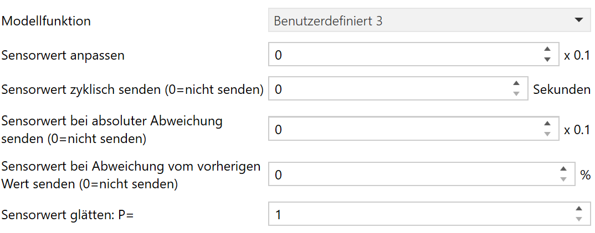

Alle Anpassungen funktionieren genau so wie bei Temperaturen beschrieben.

### **Familie 29 und 3A - Input/Output**

Dieses Applikation unterstützt auch die I/O-Bausteine DS2408 und DS2413. Die Bausteine unterscheiden sich nur in der Anzahl der I/O-Leitungen:

* Der DS2408 hat 8 I/O-Leitungen
* Der DS2413 hat 2 I/O-Leitungen

Alles hier gesagte bezieht sich auf die 8-Leitungs-Version, gilt aber analog auch für 2 Leitungen. Während bei 8 Leitungen alle Bits 0-7 betrachtet werden, werden bei 2 Leitungen nur die Bits 0 und Bit 1 betrachtet.

Wird die Familie 29 oder 3A ausgewählt, erscheint ein passendes KO mit dem für dieses Gerät vergebenen Namen. Der DPT des KO hängt von der Modellfunktion ab.

Ferner erscheinen ein paar weitere Eingabefelder, mit denen man das Verhalten der einzelnen Input- und Output-Leitungen parametrisieren kann.

#### **Modellfunktion**

Man kann die I/O-Signale auf verschiedene Arten verwenden. Über die Auswahlliste Modellfunktion können diese Verwendungsarten festgelegt werden.

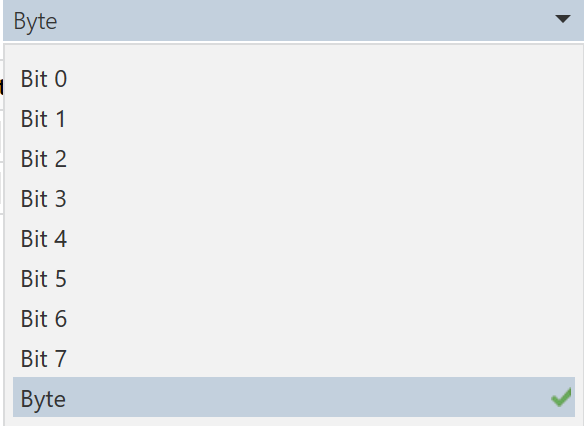

Wird die Modellfunktion "Byte" verwendet, wird ein 1-Byte-KO DPT 5.005 angezeigt. Es werden alle 8 Bit des 1-Wire-Gerätes in entsprechende Bits des KNX-KO umgesetzt.

Des weiteren erscheint eine Tabelle, mit deren Hilfe man angeben kann, welche dieser Bits als Input und welche als Output fungieren. Jedes einzelne Bit kann auch noch zusätzlich invertiert werden.

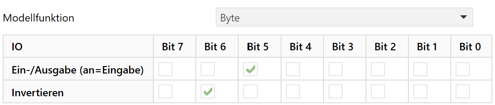

Die definition der Ein- und Ausgabe wird vom KNX-Bus aus betrachtet:

* Ausgabe bedeutet, Werte vom KNX-Bus, die im KO landen, werden vom 1-Wire-Gerät an seinen Ausgängen ausgegeben. Somit ist das KO ein Eingang.
* Eingabe bedeutet, dass ein Signal an einem Anschluss vom 1-Wire-Gerät auf den KNX-Bus geschrieben wird. Somit ist das KO ein Ausgang.

Es ist wichtig zu beachten, dass man bitweise Ein- und Ausgänge einstellt, aber immer nur ein Byte auf den KNX-Bus verschickt wird, sobald sich ein Eingangswert ändert. Wenn also eine 7 auf den Bus gesendet wird, werden die Ausgänge 0, 1 und 2 gesetzt. Wird dann der Eingang 5 geändert, wird nicht der Wert 32 auf den Bus gesendet, sondern 39 (32 + 7). Es werden immer alle gesetzten Bits auf den Bus übertragen, egal ob diese Bits über den KNX-Bus oder über die externen Eingänge gesetzt wurden.

Dieses Beispiel zeigt, dass die Behandlung von Bitwerten als Bytes auf der KNX-Seite schwierig ist. Es eignet sich aber sehr gut, um mehrere Ausgänge gleichzeitig zu setzen.

Die Modellfunktion "Bit *n*" erlaubt die Behandlung von einzelnen Bits eines I/O-Gerätes. Es wird ein 1-Bit-KO DPT 1.001 angezeigt. Es wird das entsprechende Bit des 1-Wire-Gerätes über das KNX-KO gesendet.

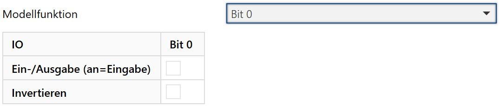

Da die Kommunikation von und zu 1-Wire über nur ein KO läuft, wird hier die Kommunikation nochmal genau beschrieben.

* Wenn das Bit als Eingabe parametriert ist, wird ein geänderter Eingangswert über das KO an den KNX-Bus gesendet. Somit ist das KO ein Ausgang, der aktiv auf den Bus senden kann. Die Flags sind K, L und Ü.
* Wenn das Bit als Ausgabe parametriert ist, wird der Ausgangswert gesetzt, sobald das KO beschrieben wurde. Somit ist das KO ein Eingang, der beschrieben werden kann. Damit der Ausgang auch einen Status zurückmelden kann, sendet das Modul den Status direkt auf demselben KO zurück. Die Flags sind K, L, S und Ü.

> **Anmerkung**: Das Senden des Status auf dem gleichen KO wie das Empfangen erlaubt eine KNX-Konforme Nutzung einer Status-GA, sofern die GA in der korrekten Reihenfolge zugewiesen wurden: Es muss immer zuerst die Status-GA zugewiesen werden (sendend), anschließend eine oder mehrere Schalt-GA.

## **Beispiele**

Eine der Stärken dieses Gateways ist es, dass einzelne 1-Wire-Geräte mehrfach genutzt werden können. So kann man bestimmte Funktionen Realisieren, ohne zusätzliche Logiken erforderlich zu machen.

### **Gleichzeitige Schaltung einer Farb-LED**

Angenommen, eine Rot-Grün-LED ist an den beiden Ausgängen eines DS2413 (2-Bit-IO) angeschlossen. Es gibt nur eine 1-Wire-ID.

Es wird ein Gerät definiert mit dieser ID und der Modulfunktion Bit 0. Der Name ist "Grün".

Jetzt wird noch ein Gerät definiert, mit selben ID und der Modulfunktion Bit 1. Der Name ist "Rot".

Man hat jetzt 2 KO "Rot" und "Grün" und kann damit die jeweilige Farbe ein- und ausschalten.

Wenn Rot und Grün gleichzeitig eingeschaltet werden, leuchtet die LED in einem Orange-Ton. Wenn aber über KNX nacheinander Rot und Grün eingeschaltet werden, sieht man an der LED, dass sie erst rot leuchtet, bevor sie orange wird.

Selbst wenn man eine Schalt-GA "Orange" an beide KO legt, sieht man noch eine gewisse Zeit lang rot, bevor es orange wird, da die beiden KO intern nacheinander abgearbeitet werden und es relativ lange dauert, diese Werte an den 1-Wire-Chip zu übertragen.

Eine weitere Möglichkeit ist es, ein drittes Gerät mit der selben ID anzulegen, mit der Modulfunktion Byte und dem Namen "Orange". Wenn jetzt auf dieses KO der Wert 3 gesendet wird, werden wirklich gleichzeitig beide IO-Ausgänge geschaltet und die Farbe Orange erscheint sofort.

Falls man ein Schalt-KO für die Farbe "Orange" haben möchte, kann man in der Logik einen Kanal definieren, der auf einen booleschen Wert hin bei True den Wert 3 und bei False den Wert 0 sendet.

### **Schaltinformation und Status trennen**

Nehmen wir mal an, man hat ein 8-Bit-IO, dessen 4 unteren Bits 0-3 einen Wert ausgeben sollen, dieser Wert wird extern verarbeitet und dann als Statusrückmeldung auf den Bits 4-7 zurückgegeben.

Dazu legt man ein Gerät mit der passenden ID des 8-Bit-IO an und setzt die oberen 4 Bits als Eingang. Wenn man jetzt eine 7 auf das KO schickt (Bit 0-2 gesetzt), wird bereits vom Gateway die 7 als Statusrückmeldung auf das KO geschrieben. Das ist soweit korrekt, da damit gesagt wird, dass die 7 erfolgreich ausgegeben wurde. Anschließend würde die externe Schaltung die 7 als Status auf die Eingänge 4-7 gespiegelt und somit als 16+32+64 = 112 zurückgegeben. Da immer alle Bits in einem Byte auf den KNX-Bus geschrieben werden, wird der Wert 112 + 7 = 119 auf das KO geschrieben.

Man erhält somit 3 Telegramme:

* eine 7, die man schreibt
* eine 7 als unmittelbare Statusmeldung des Gateways
* eine 119 als Statusmeldung der externen Schaltung

Die Statusrückmeldung kann man zwar auf eine eigene GA senden lassen (1. GA am KO, sendende GA), aber man erhält immer noch 2 Telegramme kurz hintereinander mit unterschiedlichen Werten. Das ist häufig nicht gewünscht.

Dies kann man lösen, indem man ein weiteres Gerät mit der gleichen ID des 8-Bit-IO anlegt und mit gleicher Bitmaske für Ein- und Ausgang. Dem neuen KO weist man eine neue GA zu, auf dieser GA kommen jetzt nur noch die Signale an, die von außen gesendet werden. In unserem Beispiel würde da immer nur die 119 ankommen, und war immer dann, wenn von außen ein Signal eingeht.

So kann man das Senden vom KNX nach Außen und von Außen zum KNX trennen. Man kann aber nicht erreichen, dass die für den Ausgang reservierten Bits des IO nicht mit den Eingangsignalen kombiniert werden. Im Beispiel kann man nicht erreichen, dass man 112 gesendet bekommt, es wird immer 112 + 7 = 119 sein.

## **Hardware**

Dieses Kapital beschreibt die von dieser Firmware unterstützte Hardware
(noch nicht ausgearbeitet)

Sensormodul Masifi (mit nur einem Busmaster)

WireGateway Masifi (mit bis zu 3 Busmaster)

DS2484 (Busmaster-Chip)

DS18S20 (Temperatursensor 9-Bit)

DS18B20 (Temperatursensor 12-Bit)

DS1990 (iButton)

DS2408 (8-Bit-IO)

DS2413 (2-Bit-IO)

DS2438 (Smart Battery Monitor)

## **Übersicht der vorhandenen Kommunikationsobjekte**

Die Liste zeigt nur die Kommunikationsobjekte (KO) der aktuellen Version. Es gibt noch weitere KO, die logisch betrachtet zum Logikmodul oder zum Sensormodul gehören, diese werden hier nicht aufgelistet. Es wird nur auf das entsprechende Modul verwiesen.

KO | Name | DPT | Bedeutung
:---:|:---|---:|:--
1 | bis 19 | | beschrieben im Logikmodul
20 | IDs unbekannter Geräte | 16.001 | gibt im Sekundentakt IDs aller Geräte am 1-Wire-Bus aus, deren IDs noch nicht in der Applikation angegeben wurden (1-Wire-Suchmodus)
21 | Gerätefehler Busmaster 1 | 12.001 | Fehlerbit pro Gerät am Busmaster 1
22 | Gerätefehler Busmaster 2 | 12.001 | Fehlerbit pro Gerät am Busmaster 2
23 | Gerätefehler Busmaster 3 | 12.001 | Fehlerbit pro Gerät am Busmaster 3
24 | Gruppe 1 | 1.001 | iButton Gruppe 1
25 | Gruppe 2 | 1.001 | iButton Gruppe 2
26 | Gruppe 3 | 1.001 | iButton Gruppe 3
27 | Gruppe 4 | 1.001 | iButton Gruppe 4
28 | Gruppe 5 | 1.001 | iButton Gruppe 5
29 | Gruppe 6 | 1.001 | iButton Gruppe 6
30 | Gruppe 7 | 1.001 | iButton Gruppe 7
31 | Gruppe 8 | 1.001 | iButton Gruppe 8
50 | Gerät 1, Eingang/Status oder Ausgang | | Ein- oder Ausgang vom 1-Wire-Gerät 1
bis
139 | Gerät 90, Eingang/Status oder Ausgang || Ein- oder Ausgang vom 1-Wire-Gerät 90
